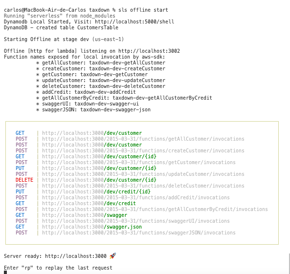
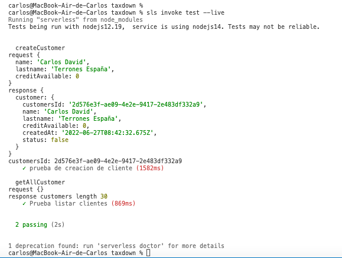
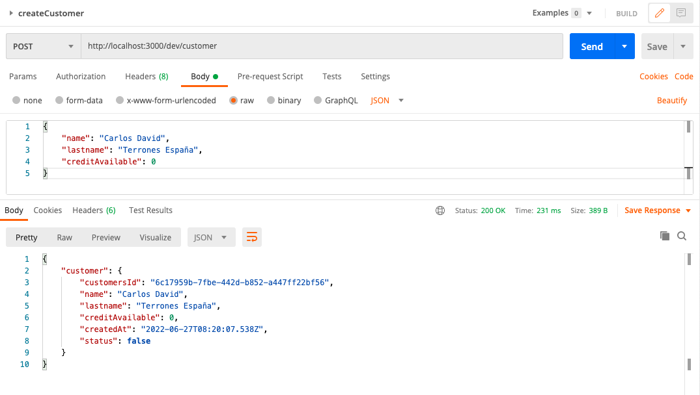

# API CUSTOMERS - TIENDA DE MOTOS TAXDOWN


## Autor
Carlos Terrones España
Cardaba713@gmail.com

## Instalando dependencias
Ejecuta los siguientes comandos

Parte 1
```
npm install -g serverless
```

Parte 2
```
npm i
npm install --save serverless-dynamodb-local
sls dynamodb install
```

## Levantar lambdas en local

```
sls offline start 

ó

sls offline
sls dynamodb start --migrate
```

## Levantar lambdas en aws
** recuerde configurar aws-cli
```
sls deploy
```

## Ejecutar pruebas en local con lambda en vivo (2 implementadas)



```
sls invoke test --live
```

## Notas Pruebas automatizadas
### crear funcion
```
sls create function -f myFunction --handler functions/myFunction/index.handler
```

### crear test:
```
sls create test -f functionName
```

### invocar test
```
sls invoke test
```

## Documntacion autogenerada con swager
ref https://github.com/completecoding/serverless-auto-swagger

### generar documentacion
```
sls generate-swagger
```

### Leer documentacion
http://localhost:3000/swagger


## Postman
Se sugiere usar postman e importar el archivo en la raiz del proyecto ***taxdown.postman_collection.json***



## Serverless - AWS Node.js Typescript
This project has been generated using the `aws-nodejs-typescript` template from the [Serverless framework](https://www.serverless.com/).
